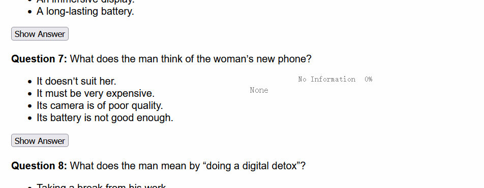
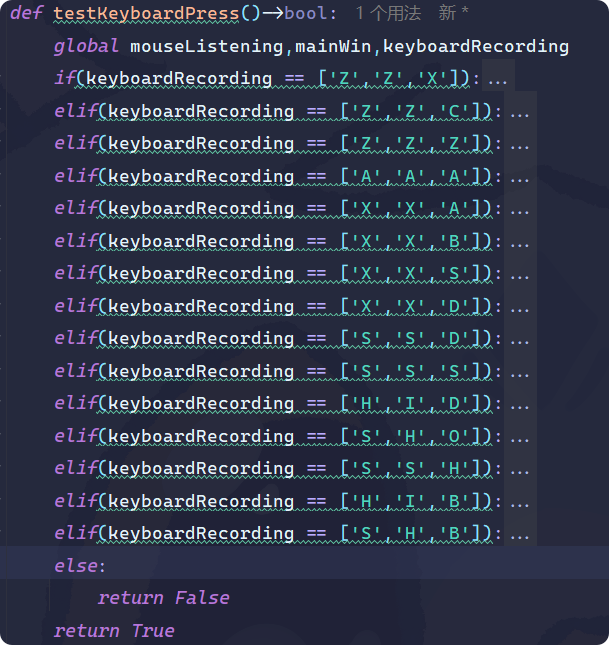

# iTest 考试助手 - 悬浮窗答案提示工具

iTest 悬浮窗匹配答案工具，通过使用VMware虚拟机进行考试，使用OCR识别屏幕上的内容来匹配答案，并通过窗口来隐藏VMware的边框和透明度极低的悬浮窗来达到不被发现的效果，内置13个组合快捷键来匹配答案。

该工具需要配合 [Bluore/Itest_Answer](https://github.com/Bluore/Itest_Answer) 来获取题库，得到`decode.json`的题库文件

> 在示例网站上演示


## 免责声明

*免责声明：本工具旨在辅助学习，请勿用于任何违反考试纪律的行为。使用过程中产生的任何后果由使用者自行承担。*

> 以下内容由AI生成，不保证正确性


## 功能特点

- **悬浮答案窗口**：半透明、无边框、可拖动的悬浮窗，显示匹配的答案。
- **OCR 识别**：使用 Tesseract OCR 对截图区域进行文字识别。
- **智能匹配**：基于最长公共子序列（LCS）或 difflib 相似度匹配，从题库中查找最相近的题目和答案。
- **快捷键操作**：通过键盘快捷键控制截图、刷新、窗口显示/隐藏等。
- **遮罩窗口**：可选的屏幕边缘遮罩，用于辅助定位截图区域。
- **多线程**：后台监听键盘鼠标，不影响主界面响应。

## 安装依赖

### 1. 克隆项目
```bash
git clone https://github.com/your-username/Itest_Exam_helper.git
cd Itest_Exam_helper
```

### 2. 安装 Python 依赖
建议使用 Python 3.8+。使用以下命令安装所需包：
```bash
pip install pyautogui PyQt5 pynput pillow pytesseract beautifulsoup4
```

### 3. 安装 Tesseract OCR
- **Windows**：下载安装 [Tesseract](https://github.com/UB-Mannheim/tesseract/wiki)，并将其安装目录添加到系统 PATH。
- **macOS**：`brew install tesseract`
- **Linux**：`sudo apt install tesseract-ocr`

### 4. 获取题库文件 `decode.json`
题库文件需要从 [Bluore/Itest_Answer](https://github.com/Bluore/Itest_Answer) 项目获取。下载后将其放置于项目根目录下，命名为 `decode.json`。

## 使用教程

### 1. 启动程序
运行主脚本：
```bash
python itest_main.py
```
启动后，屏幕右下角会出现一个半透明的悬浮窗（标题为 "ansShow Window"），同时屏幕四周可能会出现彩色遮罩窗口（用于辅助定位）。

### 2. 基本操作流程
1. **开启截图模式**：按下快捷键 `Z Z X`（依次按下 Z、Z、X），悬浮窗状态会变为 "Select"。
2. **选择截图区域**：
   - **方式一（鼠标点击）**：在屏幕上单击并拖动鼠标，选择矩形区域后释放。
   - **方式二（键盘辅助）**：在截图模式下，按 `A` 键记录第一个点，移动鼠标后再按 `A` 记录第二个点（连续截图模式）。
3. **自动匹配答案**：截图后，程序自动进行 OCR 识别，并在题库中查找匹配的题目，将答案显示在悬浮窗中。
4. **查看答案**：匹配成功后，答案会显示在悬浮窗的文本区域，同时状态变为 "Show"。

### 3. 快捷键列表

| 快捷键 | 功能说明 |
|--------|----------|
| Z Z X  | 开启截图模式（鼠标监听） |
| Z Z C  | 取消截图模式 |
| Z Z Z  | 将悬浮窗置顶显示 |
| A A A  | 刷新答案（重新执行当前区域的 OCR 与匹配） |
| X X B  | 放大悬浮窗（400×500） |
| X X S  | 缩小悬浮窗（400×40） |
| X X D  | 恢复默认悬浮窗大小（400×100） |
| S S D  | 将遮罩窗口切换为“鸭子模式”（透明） |
| S S S  | 将遮罩窗口恢复为彩色样式 |
| H I D  | 隐藏所有遮罩窗口 |
| S H O  | 显示所有遮罩窗口 |
| S S H  | 显示/隐藏主悬浮窗 |
| H I B  | 隐藏底部遮罩窗口 |
| S H B  | 显示底部遮罩窗口 |



> 注：快捷键为顺序按键，即依次按下对应字母（不区分大小写），程序会记录最近三次按键进行匹配。

### 4. 自定义配置
- **修改窗口位置和样式**：在 `itest_main.py` 中修改 `windowInf_Mask` 和 `windowList_Style_Duck` 列表，调整遮罩窗口的位置、大小、颜色和透明度。
- **修改主窗口位置**：在 `FramelessMainWindow.initUI` 中调整 `self.move(1000, 1350)` 坐标。
- **修改题库文件路径**：修改变量 `questionsFile`（默认为 `"decode.json"`）。

### 5. 注意事项
- 请确保 Tesseract 安装正确，并支持中文识别（如需识别中文，可能需要下载中文语言包）。
- 截图区域不宜过小，否则 OCR 可能无法识别文字。
- 题库文件 `decode.json` 需要与主程序在同一目录，且格式为 JSON 数组，每个元素包含 `"text"`（题目原文）和 `"answer"`（答案）字段。
- 该工具仅供学习交流，请勿用于任何违规考试。

## 项目结构

```
Itest_Exam_helper/
├── itest_main.py          # 主程序
├── decode.json            # 题库文件（需自行获取）
├── cutScreen.png          # 临时截图文件（运行时生成）
├── README.md              # 说明文档
├── image/                 # 示例图片
│   ├── 1.png
│   └── 2.gif
└── .venv/                 # Python 虚拟环境（可选）
```

## 常见问题

**Q: 运行后提示 `pytesseract.pytesseract.TesseractNotFoundError`**
A: 请检查 Tesseract 是否正确安装，并将其路径添加到系统环境变量。也可在代码中通过 `pytesseract.pytesseract.tesseract_cmd = r'C:\Program Files\Tesseract-OCR\tesseract.exe'` 指定。

**Q: 截图后匹配不到答案**
A: 可能原因：
   1. 截图区域文字不清晰，OCR 识别结果不准确。
   2. 题库中没有相似的题目。
   3. 题库文件格式不正确。

**Q: 悬浮窗无法拖动**
A: 拖动区域为悬浮窗顶部的蓝色条（100×20 像素），请确保鼠标点击在该区域内。

**Q: 如何退出程序**
A: 直接关闭悬浮窗，或按 Ctrl+C 终止终端进程。

## 再次免责声明

*免责声明：本工具旨在辅助学习，请勿用于任何违反考试纪律的行为。使用过程中产生的任何后果由使用者自行承担。*
